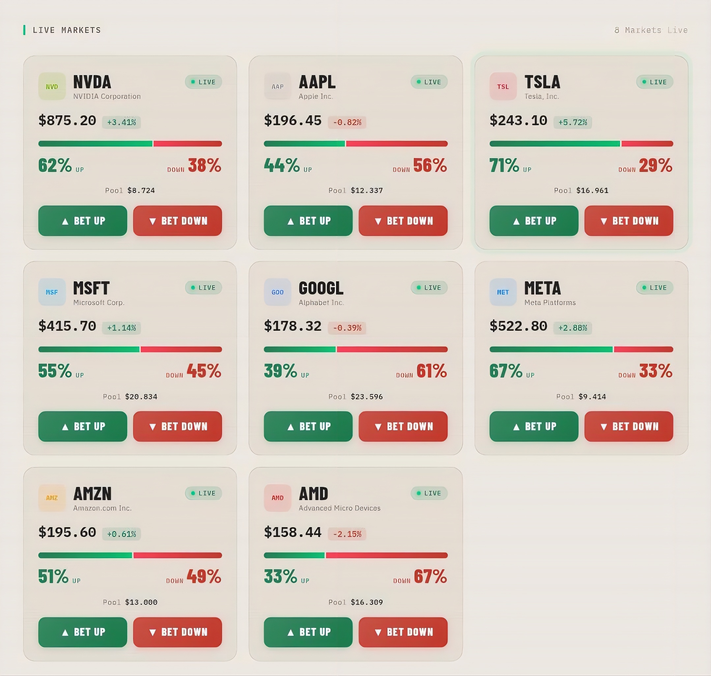

StockDuel

Real-time market duels.
Fight the market. Win the pool.

---

Live Demo

https://stock-duel.vercel.app/

---

Overview

StockDuel is a real-time trading game where users compete by choosing market direction.

StockDuel turns trading into a competitive game — where every decision happens in real time.

Each market is a live duel between two sides:

- UP
- DOWN

Players join a side, and when the round ends, the winning side takes the pool.

---

Core Concept

StockDuel is built around speed, competition, and short timeframes.

Instead of long-term analysis:

- decisions are made in seconds
- outcomes are resolved in minutes

Every round is designed to feel immediate, reactive, and competitive.

Each round is designed to be fast, reactive, and engaging.

---

How It Works

1. Browse live markets
2. Select an asset
3. Choose UP or DOWN
4. Enter your amount
5. Wait for the round to end
6. Winners share the pool

---

Game Mechanics

- Fixed round duration (5 minutes)
- Simulated real-time price movement
- Dynamic probability shifts
- Pool-based reward distribution

---

Features

- Duel-based market system
- Live price updates
- Probability tracking (UP vs DOWN)
- Countdown per market
- Pool tracking
- Interactive trading interface

---

Tech Stack

- HTML / CSS / JavaScript
- Frontend-only prototype
- No backend integration

---

Roadmap

Phase 1

- UI and interaction system
- Market simulation

Phase 2

- Wallet connection
- Trade execution

Phase 3

- Leaderboard and player stats
- Session tracking

Phase 4

- On-chain settlement
- Real liquidity integration

---

Positioning

StockDuel is not a traditional trading platform or prediction market.

It is a competitive trading experience designed around short, time-based market interactions.

---

Vision

To make trading faster, more interactive, and more engaging.

A system where decisions are immediate and outcomes are visible within minutes.

---

Status

Early-stage prototype.
Actively evolving.

---

Disclaimer

This project is experimental and for demonstration purposes only.
Not financial advice.
